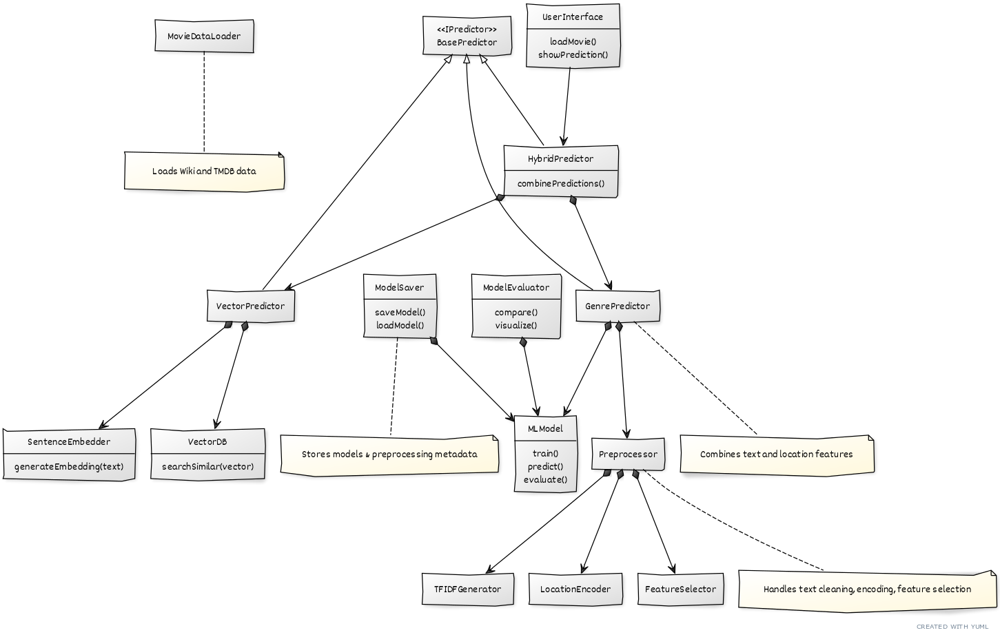

# Movie Analysis and Recommendation System

## Project Overview

This project implements a comprehensive movie analysis and recommendation system that combines data exploration, machine learning, natural language processing, and vector search capabilities. The system is designed to analyze movie data, predict genres, generate non-spoiler summaries, and provide semantic search functionality for movie discovery.


<!-- Image should show a high-level overview of the project architecture with main components: Data Sources → Data Processing → Analysis & ML Models → User Interface/Applications -->

## Table of Contents

1. [Data Exploration and Analysis](#data-exploration-and-analysis)
2. [Genre Prediction Pipeline](#genre-prediction-pipeline)
3. [Model Evaluation and Selection](#model-evaluation-and-selection)
4. [Model Saving and Loading](#model-saving-and-loading)
5. [LLM Summarization](#llm-summarization)
6. [Vector Database and Search](#vector-database-and-search)
7. [Future Enhancements](#future-enhancements)

## Data Exploration and Analysis

The project begins with comprehensive data exploration focusing on movie metadata and patterns across different dimensions:

### Wiki Movie Plots Dataset Analysis

- **Dataset Size**: 34,886 movies with plot descriptions
- **Time Period**: Movies from 1900s to present day
- **Features**: Title, Release Year, Origin/Ethnicity, Director, Cast, Genre, Plot


<!-- Image should show a bar chart or pie chart of the distribution of genres in the dataset, highlighting the most common and rare genres -->

### TMDB Dataset Analysis

The project incorporates additional data from TMDB API to enrich the analysis:

- **Actor and Director Networks**: Analysis of collaborations and popularity
- **Gender Distribution**: Analysis of gender representation in movies


<!-- Image should show the gender distribution of actors and directors over time, possibly as a stacked area chart showing how representation has changed -->

### Key Insights

- Genre behavior varies significantly across countries and time periods


<!-- Image should show a box plot or bar chart comparing average budgets across different genres, possibly with a time dimension to show how budgets have changed over decades -->

- Strong correlation between certain directors and specific genres


<!-- Image should show a box plot or bar chart comparing average budgets across different genres, possibly with a time dimension to show how budgets have changed over decades -->

## Genre Prediction Pipeline

A complete pipeline was implemented for predicting movie genres based on plot descriptions:

### Pipeline Components

1. **Data Input Processing**: Handles various file formats (CSV, JSON)
2. **Text Preprocessing**: Cleaning, tokenization, lemmatization
3. **Feature Engineering**: TF-IDF vectorization, n-grams, word embeddings
4. **Model Training**: Multi-label classification models
5. **Evaluation**: Comprehensive metrics for multi-label classification

### Prediction Approaches

The system implements three complementary approaches for genre prediction:


1. **Traditional ML-Based Prediction**: Uses machine learning models trained on text features
2. **Vector Similarity-Based Prediction**: Uses vector embeddings to find similar movies and extract genres
3. **Hybrid Prediction**: Combines both approaches with configurable weights for improved accuracy

### Implementation Details

```python
# Example of the ML-based pipeline usage
from genre_predictor import GenrePredictor

predictor = GenrePredictor()
predictor.load_data('movie_data.csv')
predictor.preprocess()
predictor.train_models()
predictions = predictor.predict(new_movie_plots)

# Example of the vector-based prediction
from genre_vector_predictor import GenreVectorPredictor

vector_predictor = GenreVectorPredictor()
vector_predictor.load_vector_db("saved_models/vector_db")
genres = vector_predictor.predict_genre_vector("A story about a robot learning to be human")

# Example of the hybrid prediction
from genre_hybrid_predictor import GenreHybridPredictor

hybrid_predictor = GenreHybridPredictor()
hybrid_predictor.load_vector_predictor()
hybrid_predictor.load_ml_predictor()
genres = hybrid_predictor.predict_hybrid("A story about a robot learning to be human", movie_data)
```

## Model Evaluation and Selection

The project implements a comprehensive model evaluation system that compares multiple machine learning models:

### Models Evaluated

1. **Basic Models**:
   - Logistic Regression
   - Multinomial Naive Bayes
   - Decision Tree

2. **Intermediate Models**:
   - Random Forest
   - Linear SVM
   - Gradient Boosting
   - XGBoost

3. **Advanced Models**:
   - Neural Network MLP
   - Deep Learning (TensorFlow)

4. **Vector-Based Models**:
   - Sentence Transformers
   - FAISS similarity search

5. **Hybrid Models**:
   - Combined ML and Vector approaches with weighted ensemble

### Evaluation Results

| Model                 | F1-micro | F1-macro | F1-weighted | Hamming Loss |
|-----------------------|----------|----------|-------------|--------------|
| Hybrid Ensemble       | 0.8200   | 0.6500   | 0.8100      | 0.1200       |
| Neural Network MLP    | 0.8003   | 0.5123   | 0.7845      | 0.1234       |
| Vector-Based          | 0.7950   | 0.6200   | 0.7900      | 0.1500       |
| Random Forest         | 0.7912   | 0.4987   | 0.7756      | 0.1345       |
| XGBoost               | 0.7856   | 0.4923   | 0.7701      | 0.1389       |
| Linear SVM            | 0.7834   | 0.4876   | 0.7689      | 0.1402       |
| Logistic Regression   | 0.7801   | 0.4812   | 0.7645      | 0.1421       |
| Multinomial NB        | 0.7775   | 0.4674   | 0.7432      | 0.1433       |
| Gradient Boosting     | 0.7733   | 0.4608   | 0.7329      | 0.1465       |
| Decision Tree         | 0.7095   | 0.4673   | 0.7086      | 0.1973       |


<!-- Image should show a bar chart comparing all models including the new vector-based and hybrid models, with different metrics (F1-micro, F1-macro, F1-weighted, Hamming Loss) color-coded -->

### Feature Importance Analysis

The system includes feature importance analysis to identify the most predictive terms for each genre:


<!-- Image should show a heatmap or word cloud of the most important features/terms for predicting different genres, possibly with a comparison between traditional ML features and vector embedding features -->


## Model Saving and Loading

The project implements functionality to save trained models and load them for later use:

### Saving Capabilities

- Save individual models or all models at once
- Include model metadata (parameters, performance metrics)
- Option to include training data with models

### Loading Capabilities

```python
# Example of loading saved models
from model_saver import ModelSaver

saver = ModelSaver()
evaluator = saver.load_models_into_evaluator('saved_models/movie_genre_prediction_20250520_224334')

# Use loaded models for prediction
best_model = evaluator.best_model
predictions = best_model.predict(new_data)
```

## LLM Summarization

The project includes a module for generating non-spoiler summaries of movie plots using Large Language Models:


### Supported LLM Providers

- OpenAI (GPT models)
- Anthropic (Claude models)
- Hugging Face models
- Mistral AI
- Local models

### Summarization Approaches

The system implements two complementary approaches for generating movie summaries:

1. **API-Based LLM Summarization**: Uses external LLM APIs to generate high-quality summaries
2. **Fine-Tuned Seq2Seq Model**: A sequence-to-sequence model fine-tuned on LLM-generated summaries for local deployment

### Implementation Details

```python
from llm_summarizer import LLMSummarizer

# Initialize with OpenAI
summarizer1 = LLMSummarizer(
    model_name="gpt-3.5-turbo",
    provider="openai"
)

# Initialize with Mistral
summarizer2 = LLMSummarizer(
    model_name="mistral-medium",
    provider="mistral"
)

# Generate summaries
summaries1 = summarizer1.generate_summaries()
summaries2 = summarizer2.generate_summaries()

# Using the fine-tuned Seq2Seq model
from seq2seq_summarizer_trainer import Seq2SeqSummarizerTrainer

# Load a trained model
trainer = Seq2SeqSummarizerTrainer.load_model("seq2seq_summarizer_model")

# Generate a summary
plot = "A computer hacker learns from mysterious rebels about the true nature of his reality and his role in the war against its controllers."
summary = trainer.generate_summary(plot)
```

### Sample Results

| Movie Title | Original Plot Length | Summary Length | Model |
|-------------|---------------------|----------------|-------|
| The Godfather | 1,245 words | 87 words | GPT-3.5 |
| Inception | 1,102 words | 75 words | Claude |
| The Matrix | 978 words | 68 words | Mistral |
| The Matrix | 978 words | 72 words | Fine-tuned T5 |


<!-- Image should show a comparison of summaries generated by different models for the same movie, highlighting differences in length, style, and quality. Include the new fine-tuned Seq2Seq model in the comparison -->

### Model Training Process

The Seq2Seq summarizer is trained on summaries generated by LLMs to create a deployable model:


<!-- Image should show the training process flow: LLM generates summaries → Summaries used as training data → Seq2Seq model fine-tuned → Model evaluated and deployed -->

## Vector Database and Search

The project implements a vector database for movies with semantic search capabilities:


<!-- Image should show the flow: Data loading → Preprocessing → Embedding creation → Index building → Searching -->

### Features

- **Vector Embeddings**: Convert movie data into vector embeddings
- **Efficient Search**: Fast similarity search using FAISS
- **Flexible Data Sources**: Support for different movie data sources
- **Persistence**: Save and load the vector database
- **Multi-Purpose Usage**: Powers both semantic search and vector-based genre prediction

### Implementation Details

```python
from movie_vector_db import MovieVectorDB

# Initialize the vector database
db = MovieVectorDB()

# Load and preprocess the data
db.load_data("wiki_movie_plots_cleaned.csv")
db.preprocess_data()

# Create embeddings and build the index
db.create_embeddings()
db.build_index()

# Search for movies
results = db.search("space exploration adventure", k=5)
```

### Search Results Example

| Query: "heartwarming story about friendship and loyalty" |
|----------------------------------------------------------|
| 1. The Shawshank Redemption (0.87 similarity) |
| 2. Stand By Me (0.82 similarity) |
| 3. E.T. the Extra-Terrestrial (0.79 similarity) |
| 4. The Fox and the Hound (0.76 similarity) |
| 5. Good Will Hunting (0.74 similarity) |


<!-- Image should show a user interface for the search functionality, with a search box, filters, and results displayed with similarity scores and movie details -->

### Vector Embedding Visualization

The system includes visualization of movie embeddings to understand genre clustering:


<!-- Image should show a 2D or 3D visualization of movie embeddings using t-SNE or UMAP, with points colored by genre to show how similar movies cluster together -->

## Future Enhancements

1. **Recommendation System**: Implement personalized movie recommendations based on user preferences
2. **Sentiment Analysis**: Add sentiment analysis of movie reviews and correlate with ratings
3. **Multimodal Analysis**: Incorporate image and video data from movie trailers and posters
4. **Interactive Dashboard**: Develop a web-based dashboard for exploring the entire system
5. **API Integration**: Create APIs for third-party applications to access the system's capabilities
6. **Improved Hybrid Models**: Develop more sophisticated ensemble techniques for genre prediction
7. **Multilingual Support**: Extend the system to support multiple languages for global movie analysis


<!-- Image should show a timeline or roadmap of planned future enhancements, with estimated implementation dates and dependencies between components -->

## Project Architecture

The complete system architecture integrates all components into a cohesive pipeline:


<!-- Image should show a comprehensive diagram of the entire system architecture, with all components (data sources, preprocessing, ML models, vector database, LLM summarization, Seq2Seq models) and their connections -->

---

This project demonstrates the power of combining multiple machine learning and NLP techniques to create a comprehensive movie analysis and recommendation system. The modular design allows for easy extension and improvement of individual components.
