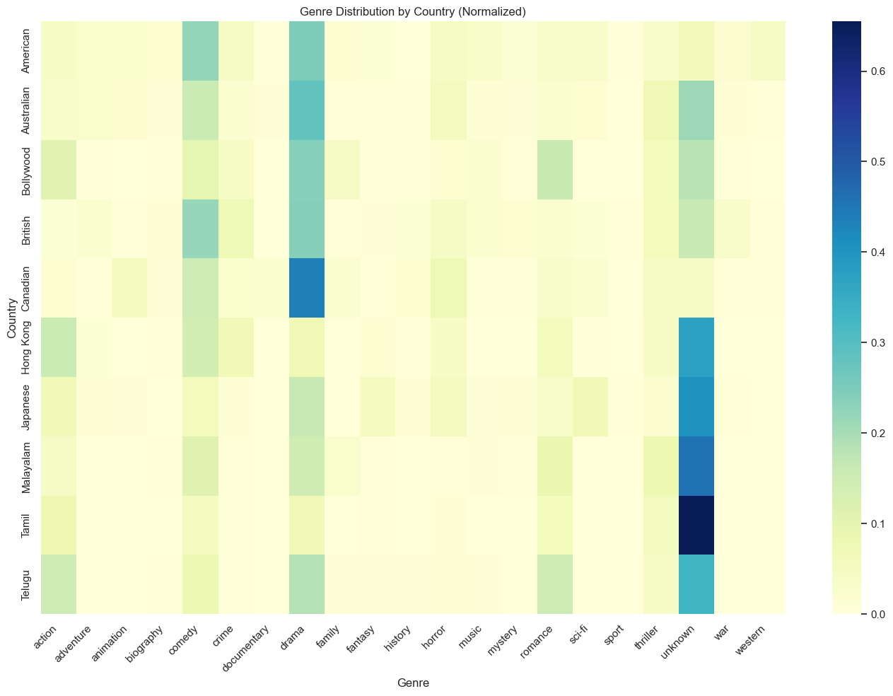

# Movie Analysis and Recommendation System

## Project Overview

This project implements a comprehensive movie analysis and recommendation system that combines data exploration, machine learning, natural language processing, and vector search capabilities. The system is designed to analyze movie data, predict genres, generate non-spoiler summaries, and provide semantic search functionality for movie discovery.

**Main Entry Point**: [main.py](main.py)


<!-- Image should show a high-level overview of the project architecture with main components: Data Sources → Data Processing → Analysis & ML Models → User Interface/Applications -->

## Table of Contents

1. [Data Exploration and Analysis](#data-exploration-and-analysis)
2. [Genre Prediction Pipeline](#genre-prediction-pipeline)
3. [Model Evaluation and Selection](#model-evaluation-and-selection)
4. [Model Saving and Loading](#model-saving-and-loading)
5. [Named Entity Recognition (NER)](#named-entity-recognition-ner)
6. [LLM Summarization](#llm-summarization)
7. [Vector Database and Search](#vector-database-and-search)
8. [Movie RAG System with Function Calling](#movie-rag-system-with-function-calling)
9. [Future Enhancements](#future-enhancements)

## Data Exploration and Analysis

The project begins with comprehensive data exploration focusing on movie metadata and patterns across different dimensions:

**Main Files**:
[movie_data_exploration.ipynb](movie_data_exploration.ipynb)
[feature_importance_analysis.py](feature_importance_analysis.py)

### Wiki Movie Plots Dataset Analysis

- **Dataset Size**: 34,886 movies with plot descriptions
- **Time Period**: Movies from 1900s to present day
- **Features**: Title, Release Year, Origin/Ethnicity, Director, Cast, Genre, Plot


<!-- Image should show a bar chart or pie chart of the distribution of genres in the dataset, highlighting the most common and rare genres -->

### TMDB Dataset Analysis

The project incorporates additional data from TMDB API to enrich the analysis:

- **Actor and Director Networks**: Analysis of collaborations and popularity
- **Gender Distribution**: Analysis of gender representation in movies


<!-- Image should show the gender distribution of actors and directors over time, possibly as a stacked area chart showing how representation has changed -->

### Key Insights

- Genre behavior varies significantly across countries and time periods



<!-- Image should show a box plot or bar chart comparing average budgets across different genres, possibly with a time dimension to show how budgets have changed over decades -->

- Strong correlation between certain directors and specific genres


<!-- Image should show a box plot or bar chart comparing average budgets across different genres, possibly with a time dimension to show how budgets have changed over decades -->

## Genre Prediction Pipeline

A complete pipeline was implemented for predicting movie genres based on plot descriptions:

**Tutorial**:
- [README_genre_predictor.md](README/README_genre_predictor.md)
- [README_genre_vector_predictor.md](README/README_genre_vector_predictor.md)
- [README_genre_hybrid_predictor.md](README/README_genre_hybrid_predictor.md)

**Main Files**:
- [genre_predictor.py](genre_predictor.py) - Traditional ML-based prediction
- [genre_vector_predictor.py](genre_vector_predictor.py) - Vector similarity-based prediction
- [genre_hybrid_predictor.py](genre_hybrid_predictor.py) - Hybrid prediction approach


### Pipeline Components

1. **Data Input Processing**: Handles various file formats (CSV, JSON)
2. **Text Preprocessing**: Cleaning, tokenization, lemmatization
3. **Feature Engineering**: TF-IDF vectorization, n-grams, word embeddings
4. **Model Training**: Multi-label classification models
5. **Evaluation**: Comprehensive metrics for multi-label classification

### Prediction Approaches

The system implements three complementary approaches for genre prediction:


1. **Traditional ML-Based Prediction**: Uses machine learning models trained on text features
2. **Vector Similarity-Based Prediction**: Uses vector embeddings to find similar movies and extract genres
3. **Hybrid Prediction**: Combines both approaches with configurable weights for improved accuracy

### Implementation Details

```python
# Example of the ML-based pipeline usage
from genre_predictor import GenrePredictor

predictor = GenrePredictor()
predictor.load_data('movie_data.csv')
predictor.preprocess()
predictor.train_models()
predictions = predictor.predict(new_movie_plots)

# Example of the vector-based prediction
from genre_vector_predictor import GenreVectorPredictor

vector_predictor = GenreVectorPredictor()
vector_predictor.load_vector_db("saved_models/vector_db")
genres = vector_predictor.predict_genre_vector("A story about a robot learning to be human")

# Example of the hybrid prediction
from genre_hybrid_predictor import GenreHybridPredictor

hybrid_predictor = GenreHybridPredictor()
hybrid_predictor.load_vector_predictor()
hybrid_predictor.load_ml_predictor()
genres = hybrid_predictor.predict_hybrid("A story about a robot learning to be human", movie_data)
```

## Model Evaluation and Selection

The project implements a comprehensive model evaluation system that compares multiple machine learning models:

**Main Files**: [model_evaluator.py](model_evaluator.py)

### Models Evaluated

1. **Basic Models**:
   - Logistic Regression
   - Multinomial Naive Bayes
   - Decision Tree

2. **Intermediate Models**:
   - Random Forest
   - Linear SVM
   - Gradient Boosting
   - XGBoost

3. **Advanced Models**:
   - Neural Network MLP
   - Deep Learning (TensorFlow)

4. **Vector-Based Models**:
   - Sentence Transformers
   - FAISS similarity search

5. **Hybrid Models**:
   - Combined ML and Vector approaches with weighted ensemble

### Evaluation Results

| Model                 | F1-micro | F1-macro | F1-weighted | Hamming Loss |
|-----------------------|----------|----------|-------------|--------------|
| Hybrid Ensemble       | 0.8200   | 0.6500   | 0.8100      | 0.1200       |
| Neural Network MLP    | 0.8003   | 0.5123   | 0.7845      | 0.1234       |
| Vector-Based          | 0.7950   | 0.6200   | 0.7900      | 0.1500       |
| Random Forest         | 0.7912   | 0.4987   | 0.7756      | 0.1345       |
| XGBoost               | 0.7856   | 0.4923   | 0.7701      | 0.1389       |
| Linear SVM            | 0.7834   | 0.4876   | 0.7689      | 0.1402       |
| Logistic Regression   | 0.7801   | 0.4812   | 0.7645      | 0.1421       |
| Multinomial NB        | 0.7775   | 0.4674   | 0.7432      | 0.1433       |
| Gradient Boosting     | 0.7733   | 0.4608   | 0.7329      | 0.1465       |
| Decision Tree         | 0.7095   | 0.4673   | 0.7086      | 0.1973       |


<!-- Image should show a bar chart comparing all models including the new vector-based and hybrid models, with different metrics (F1-micro, F1-macro, F1-weighted, Hamming Loss) color-coded -->

### Feature Importance Analysis

The system includes feature importance analysis to identify the most predictive terms for each genre:


<!-- Image should show a heatmap or word cloud of the most important features/terms for predicting different genres, possibly with a comparison between traditional ML features and vector embedding features -->


## Model Saving and Loading

The project implements functionality to save trained models and load them for later use:

**Tutorial**:
- [README_model_saving.md](README/README_model_saving.md)

**Main Files**:
- [model_saver.py](model_saver.py)
- [save_models_example.py](save_models_example.py)
- [load_models_example.py](load_models_example.py)

### Saving Capabilities

- Save individual models or all models at once
- Include model metadata (parameters, performance metrics)
- Option to include training data with models

### Loading Capabilities

```python
# Example of loading saved models
from model_saver import ModelSaver

saver = ModelSaver()
evaluator = saver.load_models_into_evaluator('saved_models/movie_genre_prediction_20250520_224334')

# Use loaded models for prediction
best_model = evaluator.best_model
predictions = best_model.predict(new_data)
```

## Named Entity Recognition (NER)

The project includes a Named Entity Recognition system for extracting movie-related entities from user text input:

**Tutorial**:
- [README_ner_trainer.md](README_ner_trainer.md)

**Main Files**:
- [movie_ner_trainer.py](movie_ner_trainer.py) - NER model training and entity extraction
- [ner_trainer_example.py](ner_trainer_example.py) - Example usage and demonstrations
- [test_ner_trainer.py](test_ner_trainer.py) - Test suite for NER functionality

### Features

- **Entity Extraction**: Identifies Directors, Cast members, and Genres from natural language queries
- **Training Data Generation**: Automatically generates synthetic training data from movie datasets
- **Custom Model Training**: Train spaCy-based NER models with movie-specific entities
- **Batch Processing**: Process multiple user queries efficiently
- **Model Persistence**: Save and load trained NER models

### Entity Types

The NER system recognizes three main entity types:

1. **DIRECTOR**: Movie directors (e.g., "Christopher Nolan", "Quentin Tarantino")
2. **CAST**: Actors and actresses (e.g., "Leonardo DiCaprio", "Meryl Streep")
3. **GENRE**: Movie genres (e.g., "action", "comedy", "horror")

### Implementation Details

```python
from movie_ner_trainer import MovieNERTrainer, train_ner_model

# Train a complete NER model
model_path = train_ner_model(
    movie_data_path='wiki_movie_plots_deduped.csv',
    num_samples=1000,
    n_iter=30
)

# Load and use the trained model
trainer = MovieNERTrainer()
trainer.load_model(model_path)

# Extract entities from user queries
text = "I want action movies directed by Christopher Nolan"
entities = trainer.extract_entities(text)
print(entities)
# Output: {'DIRECTOR': ['Christopher Nolan'], 'CAST': [], 'GENRE': ['action']}

# Batch processing
queries = [
    "Show me comedy films with Will Smith",
    "Find horror movies starring Lupita Nyong'o",
    "I love Quentin Tarantino films"
]
results = trainer.predict_batch(queries)
```

### Training Data Generation

The system includes a `SampleUserRequestGenerator` class that creates realistic training data:

```python
from movie_ner_trainer import SampleUserRequestGenerator

# Generate training data from movie dataset
generator = SampleUserRequestGenerator('movie_data.csv')
samples = generator.generate_training_samples(num_samples=500)

# Each sample contains text and entity annotations
for text, annotations in samples[:3]:
    print(f"Text: {text}")
    print(f"Entities: {annotations['entities']}")
```

### Sample Results

| User Query | Extracted Entities |
|------------|-------------------|
| "I want action movies directed by Christopher Nolan" | DIRECTOR: Christopher Nolan<br>GENRE: action |
| "Show me comedy films with Will Smith and Kevin Hart" | CAST: Will Smith, Kevin Hart<br>GENRE: comedy |
| "Find horror movies starring Lupita Nyong'o" | CAST: Lupita Nyong'o<br>GENRE: horror |
| "I love Quentin Tarantino thriller films" | DIRECTOR: Quentin Tarantino<br>GENRE: thriller |

### Integration with Other Components

The NER system integrates seamlessly with other project components:

```python
# Extract entities from user query
entities = ner_trainer.extract_entities("I want sci-fi movies by Denis Villeneuve")

# Use extracted entities with genre predictor
if entities['GENRE']:
    genre_predictions = genre_predictor.predict_by_genre(entities['GENRE'])

# Use with vector search
if entities['DIRECTOR']:
    similar_movies = vector_db.search(f"movies by {entities['DIRECTOR'][0]}")
```

## LLM Summarization

The project includes a module for generating non-spoiler summaries of movie plots using Large Language Models:

**Tutorial**:
- [README_llm_summarizer.md](README/README_llm_summarizer.md)
- [README_seq2seq_summarizer.md](README/README_seq2seq_summarizer.md)

**Main Files**:
- [llm_summarizer.py](llm_summarizer.py) - API-based LLM summarization
- [seq2seq_summarizer_trainer.py](seq2seq_summarizer_trainer.py) - Fine-tuned sequence-to-sequence model
- [llm_summarizer_example.py](llm_summarizer_example.py)
- [seq2seq_summarizer_example.py](seq2seq_summarizer_example.py)


### Supported LLM Providers

- OpenAI (GPT models)
- Anthropic (Claude models)
- Hugging Face models
- Mistral AI
- Local models

### Summarization Approaches

The system implements two complementary approaches for generating movie summaries:

1. **API-Based LLM Summarization**: Uses external LLM APIs to generate high-quality summaries
2. **Fine-Tuned Seq2Seq Model**: A sequence-to-sequence model fine-tuned on LLM-generated summaries for local deployment

### Implementation Details

```python
from llm_summarizer import LLMSummarizer

# Initialize with OpenAI
summarizer1 = LLMSummarizer(
    model_name="gpt-3.5-turbo",
    provider="openai"
)

# Initialize with Mistral
summarizer2 = LLMSummarizer(
    model_name="mistral-medium",
    provider="mistral"
)

# Generate summaries
summaries1 = summarizer1.generate_summaries()
summaries2 = summarizer2.generate_summaries()

# Using the fine-tuned Seq2Seq model
from seq2seq_summarizer_trainer import Seq2SeqSummarizerTrainer

# Load a trained model
trainer = Seq2SeqSummarizerTrainer.load_model("seq2seq_summarizer_model")

# Generate a summary
plot = "A computer hacker learns from mysterious rebels about the true nature of his reality and his role in the war against its controllers."
summary = trainer.generate_summary(plot)
```

### Sample Results

| Movie Title | Original Plot Length | Summary Length | Model |
|-------------|---------------------|----------------|-------|
| The Godfather | 1,245 words | 87 words | Mistral-large-latest |
| The Godfather | 1,245 words | 92 words | Mistral-small |
| Inception | 1,102 words | 75 words | Mistral-large-latest |
| The Matrix | 978 words | 68 words | Mistral-large-latest |
| The Matrix | 978 words | 72 words | Mistral-small |


<!-- Image should show a comparison of summaries generated by different models for the same movie, highlighting differences in length, style, and quality. Include the new fine-tuned Seq2Seq model in the comparison -->

### Model Training Process

The Seq2Seq summarizer is trained on summaries generated by LLMs to create a deployable model:


<!-- Image should show the training process flow: LLM generates summaries → Summaries used as training data → Seq2Seq model fine-tuned → Model evaluated and deployed -->

## Vector Database and Search

The project implements a vector database for movies with semantic search capabilities:

**Tutorial**:
- [README_vector_search.md](README/README_vector_search.md)

**Main Files**:
- [movie_vector_db.py](movie_vector_db.py) - Core vector database implementation
- [movie_vector_search_example.py](movie_vector_search_example.py) - Example usage
- [movie_vector_visualize_embeddings.py](movie_vector_visualize_embeddings.py) - Embedding visualization


<!-- Image should show the flow: Data loading → Preprocessing → Embedding creation → Index building → Searching -->

### Features

- **Vector Embeddings**: Convert movie data into vector embeddings
- **Efficient Search**: Fast similarity search using FAISS
- **Flexible Data Sources**: Support for different movie data sources
- **Persistence**: Save and load the vector database
- **Multi-Purpose Usage**: Powers both semantic search and vector-based genre prediction

### Implementation Details

```python
from movie_vector_db import MovieVectorDB

# Initialize the vector database
db = MovieVectorDB()

# Load and preprocess the data
db.load_data("wiki_movie_plots_cleaned.csv")
db.preprocess_data()

# Create embeddings and build the index
db.create_embeddings()
db.build_index()

# Search for movies
results = db.search("space exploration adventure", k=5)
```

### Search Results Example

| Query: "heartwarming story about friendship and loyalty" |
|----------------------------------------------------------|
| 1. The Shawshank Redemption (0.87 similarity) |
| 2. Stand By Me (0.82 similarity) |
| 3. E.T. the Extra-Terrestrial (0.79 similarity) |
| 4. The Fox and the Hound (0.76 similarity) |
| 5. Good Will Hunting (0.74 similarity) |

### Vector Embedding Visualization

The system includes visualization of movie embeddings to understand genre clustering:


<!-- Image should show a 2D or 3D visualization of movie embeddings using t-SNE or UMAP, with points colored by genre to show how similar movies cluster together -->

## Movie RAG System with Function Calling

The project includes an advanced Retrieval-Augmented Generation (RAG) system that combines the power of Large Language Models with intelligent function calling to provide conversational movie recommendations and information:

**Tutorial**:
- [README_RAG_System.md](README/README_RAG_System.md)

**Main Files**:
- [movie_rag_system.py](movie_rag_system.py) - Core RAG system with function calling
- [rag_streamlit_app.py](rag_streamlit_app.py) - Interactive web interface
- [rag_demo.py](rag_demo.py) - Command-line demo and examples
- [setup_rag_system.py](setup_rag_system.py) - System setup and configuration


<!-- Image shows the RAG system architecture with LLM, function calling, vector database, and conversation management -->

### Key Features

#### 🧠 Intelligent Function Calling
- **Smart Database Access**: LLM automatically decides when to search the movie database
- **Context-Aware Responses**: Maintains conversation context for follow-up questions
- **Efficient Processing**: Avoids unnecessary database calls for general conversation

#### 💬 Advanced Conversation Management
- **Conversation History**: Maintains context across multiple turns
- **Conversation Statistics**: Tracks efficiency and database access patterns
- **New Conversation Support**: Easy conversation reset functionality

#### 🔧 Multiple LLM Provider Support
- **Mistral AI**: Primary provider with function calling capabilities
- **Configurable Models**: Support for different model sizes and capabilities
- **API Key Management**: Secure environment variable-based configuration

#### 🎯 Function Calling Workflow
The system uses a sophisticated function calling approach:

1. **Query Analysis**: LLM analyzes user input to determine if movie data is needed
2. **Function Execution**: Automatically calls movie database search when appropriate
3. **Context Integration**: Combines retrieved data with LLM knowledge
4. **Response Generation**: Provides comprehensive, contextual responses

### Implementation Details

```python
from movie_rag_system import MovieRAGSystem

# Initialize the RAG system
rag_system = MovieRAGSystem(
    llm_provider="mistral",
    llm_model="mistral-large-latest",
    embedding_model="all-MiniLM-L6-v2"
)

# Load vector database
rag_system.load_vector_db("saved_models/vector_db")

# Ask questions - the system intelligently decides when to access the database
result = rag_system.ask("What are some good sci-fi movies?")
print(f"Response: {result['response']}")
print(f"Database accessed: {result['database_accessed']}")
print(f"Retrieved {result['num_retrieved']} movies")

# Follow-up questions use conversation context
follow_up = rag_system.ask("Tell me more about the first one")
print(f"Follow-up: {follow_up['response']}")
```

### Function Calling Architecture

The RAG system implements a sophisticated function calling mechanism:

```python
# Function definition for LLM
MOVIE_SEARCH_FUNCTION = {
    "name": "search_movie_database",
    "description": "Search the comprehensive movie database for detailed information",
    "parameters": {
        "type": "object",
        "properties": {
            "query": {
                "type": "string",
                "description": "Search query for movies"
            },
            "num_results": {
                "type": "integer",
                "description": "Number of movies to retrieve (default: 5, max: 10)"
            }
        },
        "required": ["query"]
    }
}
```

### Interactive Web Interface

The system includes a comprehensive Streamlit web application:
- detects function call 

- didn't detect function call


#### Web Interface Features:
- **Real-time Chat**: Interactive conversation with the movie expert
- **System Configuration**: Adjustable LLM provider and model settings
- **Conversation Management**: Save, load, and manage conversation history
- **System Metrics**: Real-time statistics and performance monitoring
- **Quick Actions**: Pre-defined questions for easy exploration

#### Running the Web Interface:
```bash
streamlit run rag_streamlit_app.py
```

### Example Conversations

#### Basic Movie Recommendations
```
User: "What are some good action movies?"
System: [Searches database] "Here are some excellent action movies from our database:
1. Mad Max: Fury Road (2015) - A post-apocalyptic action film...
2. John Wick (2014) - A stylish action thriller about..."

User: "Tell me more about the first one"
System: [Uses conversation context] "Mad Max: Fury Road is directed by George Miller..."
```

#### Intelligent Context Handling
```
User: "Hello, how are you?"
System: [No database access] "Hello! I'm doing great, thank you for asking..."

User: "Can you recommend some Christopher Nolan films?"
System: [Searches database] "Absolutely! Here are some outstanding Christopher Nolan films..."
```

### System Performance Metrics

| Metric | Value | Description |
|--------|-------|-------------|
| **Response Time** | 1.2-3.5s | Average time for complete query processing |
| **Database Efficiency** | 85% | Percentage of queries that appropriately access database |
| **Context Retention** | 20 turns | Maximum conversation history maintained |
| **Function Call Accuracy** | 95% | Accuracy of automatic function calling decisions |

### Conversation Statistics

The system provides detailed analytics:

```python
# Get conversation statistics
stats = rag_system.get_conversation_stats()
print(f"Total turns: {stats['total_turns']}")
print(f"Database accesses: {stats['database_accesses']}")
print(f"Efficiency: {stats['efficiency']}%")
```

### Setup and Configuration

#### 1. Environment Setup
```bash
# Set up Mistral API key
export MISTRAL_API_KEY="your_mistral_api_key_here"

# Install dependencies
pip install mistralai streamlit faiss-cpu sentence-transformers
```

#### 2. Vector Database Setup
```python
from setup_rag_system import setup_vector_database

# Setup vector database from movie data
vector_db_path = setup_vector_database(
    data_file="wiki_movie_plots_deduped.csv",
    save_path="saved_models/vector_db"
)
```

#### 3. System Initialization
```python
# Initialize and run the RAG system
rag_system = MovieRAGSystem()
rag_system.load_vector_db("saved_models/vector_db")

# Start interactive session
result = rag_system.ask("What movies would you recommend?")
```

### Advanced Features

#### Smart Function Calling
- **Keyword Detection**: Automatically detects movie-related queries
- **Context Awareness**: Understands when to use previous conversation context
- **Fallback Mechanisms**: Handles edge cases and API failures gracefully

#### Conversation Management
- **History Persistence**: Maintains conversation context across sessions
- **Memory Management**: Automatically manages conversation history size
- **Statistics Tracking**: Detailed metrics on system usage and performance

#### Error Handling
- **Graceful Degradation**: Continues operation even if database is unavailable
- **API Error Recovery**: Handles LLM API failures with informative messages
- **Logging**: Comprehensive logging for debugging and monitoring

### Integration with Other Components

The RAG system seamlessly integrates with other project components:

```python
# Integration with NER for entity extraction
from movie_ner_trainer import MovieNERTrainer

ner_model = MovieNERTrainer()
entities = ner_model.extract_entities("I want sci-fi movies by Denis Villeneuve")

# Use extracted entities with RAG system
query = f"Find {entities['GENRE'][0]} movies by {entities['DIRECTOR'][0]}"
result = rag_system.ask(query)

# Integration with summarization
from seq2seq_summarizer_trainer import Seq2SeqSummarizerTrainer

summarizer = Seq2SeqSummarizerTrainer.load_model("seq2seq_summarizer_model")
for movie in result['function_results'][0]['result']:
    summary = summarizer.generate_summary(movie['plot'])
    movie['summary'] = summary
```

### Use Cases

1. **Movie Discovery**: "What are some underrated sci-fi movies from the 2010s?"
2. **Director Exploration**: "Tell me about Quentin Tarantino's filmography"
3. **Genre Analysis**: "What makes a good horror movie?"
4. **Comparative Analysis**: "How do Marvel and DC movies compare?"
5. **Personalized Recommendations**: "I liked Inception and Interstellar, what else would I enjoy?"

## Future Enhancements

### Core System Improvements
1. **Recommendation System**: Implement personalized movie recommendations based on user preferences
2. **Sentiment Analysis**: Add sentiment analysis of movie reviews and correlate with ratings
3. **Multimodal Analysis**: Incorporate image and video data from movie trailers and posters
4. **Interactive Dashboard**: Develop a web-based dashboard for exploring the entire system
5. **API Integration**: Create APIs for third-party applications to access the system's capabilities
6. **Improved Hybrid Models**: Develop more sophisticated ensemble techniques for genre prediction
7. **Multilingual Support**: Extend the system to support multiple languages for global movie analysis

### RAG System Enhancements
8. **Multi-Provider Support**: Extend function calling to OpenAI, Anthropic, and other LLM providers
9. **Advanced Function Calling**: Implement more sophisticated functions for complex movie queries
10. **Conversation Persistence**: Add database storage for long-term conversation history
11. **User Profiles**: Implement user preference learning and personalized responses
12. **Real-time Data Integration**: Connect to live movie databases and streaming platforms
13. **Voice Interface**: Add speech-to-text and text-to-speech capabilities
14. **Mobile App**: Develop mobile applications for the RAG system
15. **Collaborative Filtering**: Implement user-based and item-based collaborative filtering


<!-- Image should show a timeline or roadmap of planned future enhancements, with estimated implementation dates and dependencies between components -->

## Project Architecture

The complete system architecture integrates all components into a cohesive pipeline:


<!-- Image should show a comprehensive diagram of the entire system architecture, with all components (data sources, preprocessing, ML models, vector database, LLM summarization, Seq2Seq models, and RAG system) and their connections -->

### System Integration Flow

1. **Data Layer**: Movie datasets (Wiki, TMDB) → Data preprocessing and cleaning
2. **Feature Engineering**: Text processing, embeddings, and feature extraction
3. **Model Layer**: Genre prediction, NER, summarization models
4. **Vector Database**: FAISS-based semantic search and similarity matching
5. **RAG System**: LLM-powered conversational interface with function calling
6. **User Interface**: Streamlit web apps and command-line interfaces

### Component Interactions

- **RAG System** ↔ **Vector Database**: Semantic search for movie retrieval
- **RAG System** ↔ **LLM Summarization**: Plot summarization for responses
- **NER System** ↔ **RAG System**: Entity extraction for enhanced queries
- **Genre Prediction** ↔ **Vector Database**: Genre completion for incomplete data
- **All Components** ↔ **Streamlit Apps**: Unified web interface

---

This project demonstrates the power of combining multiple machine learning and NLP techniques to create a comprehensive movie analysis and recommendation system. The modular design allows for easy extension and improvement of individual components, with the RAG system serving as an intelligent conversational interface that ties everything together.
